# Digital Workplace Automation Priority Model

A data-driven framework for prioritizing IT process automation, built around Micron Technology's Digital Workplace organization.

## The Problem

Micron's Digital Workplace organization spans Service Desk, Enterprise Systems Management, Field Services, Digital Employee Experience (DEX), and End User Computing: five teams generating constant requests. No consistent framework exists to compare where automation pays off first. Prioritization tends to happen by instinct, not evidence.

## Why It Matters at Micron's Scale

Micron employed approximately 53,000 people as of its fiscal year 2025 10-K (ended August 28, 2025), generating $37.38B in revenue that year, with selling, general, and administrative expenses (the budget category covering corporate functions including IT) at $1.2B. At that headcount, even small per-request inefficiencies compound fast: a process costing a few minutes of manual work per instance turns into thousands of labor hours a year once it repeats across tens of thousands of employees and a 24/7 fab operation.

This project's model was built against a 5,000-employee reference scale (matching the size most publicly available automation benchmarks are reported at). Scaled proportionally to Micron's actual workforce, the combined savings identified across the five workflows analyzed here (about $390K/year at reference scale) would extrapolate to roughly **$4.1M/year**. That figure is a directional estimate, not a claim about Micron's actual costs: it assumes uniform scaling of ticket volume across workflows, which will not hold exactly (shift-handoff volume tracks fab headcount, not total corporate headcount, for example). It is included to show the order of magnitude at stake, not as a budget number.

This scale of return is not out of line with what Micron itself reports from applying AI/automation to operations at scale: its Smart Manufacturing & AI initiative, run across 590,000 sensors and 100 million wafer images analyzed weekly, reports 1 million work hours saved annually and a 50% reduction in time-to-market for new products (Micron blog, "Smart manufacturing at Micron: AI at enterprise scale," published Dec 2025; figures based on Micron internal data, 2016-2025). That case is manufacturing, not Digital Workplace, and the methodology isn't disclosed in comparable detail to this project's, so it's cited as directional context for what AI-driven efficiency gains look like at Micron's scale, not as a benchmark this project's numbers are validated against.

## What This Project Does

Five candidate workflows were scored on a 3-axis model, benchmarked against real 2025-26 industry data, then stress-tested against a conservative risk adjustment:

```
Priority Score = (Feasibility x Impact) / Risk
```

**Workflows analyzed:** New-hire device/access provisioning, shift-handoff documentation, equipment/tool request approval, password/access reset, meeting/resource booking.

## Key Findings

| Workflow | Priority Score | Annual Savings | Payback | Risk-Adjusted 3-Yr Net |
|---|---|---|---|---|
| Equipment/Tool Request Approval | **15** | $37,800 | 9.5 mo | $60,720 |
| Onboarding/Provisioning | 10 | $78,624 | 4.6 mo | $158,698 |
| Password/Access Reset | 10 | $113,400 | 5.1 mo | **-$7,840** |
| Meeting/Resource Booking | 10 | $36,000 | 2.1 mo | $59,800 |
| Shift-Handoff Documentation | 5 | $123,930 | 2.8 mo | $102,432 |

**The standout finding:** applying a standard 20% conservative haircut to savings flips Password/Access Reset from a 5.1-month payback to a 167-month payback. The margin between real SSPR licensing cost ($1.50/user/month, PortalGuard) and real savings benchmarks (Gartner, Forrester) is thin enough that modest estimation error erases the business case. A prioritization model should surface findings like this, not just favorable ones.

**Cross-checked against published methodology:** research into RPA candidate-selection frameworks (Analytic Hierarchy Process studies with RPA practitioners; the PLOST process-mining framework) found that process standardization and transaction volume, not the generic Feasibility/Impact/Risk axes this project started with, are the criteria most predictive of automation success. Adding a Standardization score to the matrix and recalculating produces an "Enhanced Priority Score." Equipment/Tool Request Approval ranks #1 under both the original model and the enhanced one, independent confirmation that isn't just an artifact of how this project happened to weight things.

## Sensitivity Analysis

Priority Score depends on subjective 1-5 ratings for Feasibility, Impact, and Risk. To check how fragile each ranking is, every workflow's score was recalculated with each rating shifted by 1 point in either direction:

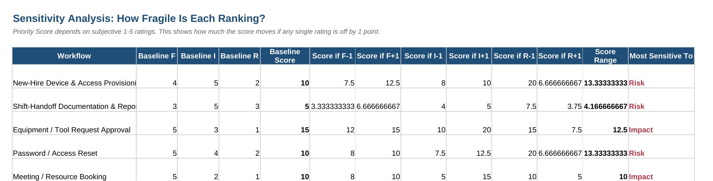

Equipment/Tool Request's top-ranked score turns out to be most sensitive to its Impact rating, not Feasibility or Risk. If Impact were scored a 4 instead of a 3, its priority score would jump from 15 to 20:

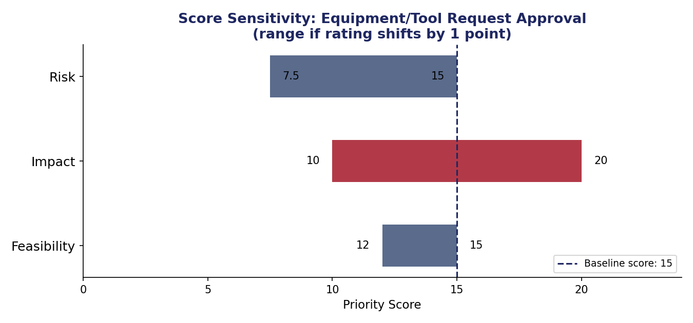

Full breakdown with editable ratings: [`data/Automation_Priority_Matrix.xlsx`](data/Automation_Priority_Matrix.xlsx), `Sensitivity_Analysis` tab.

## Limitations

This model is a prioritization framework, not a measured audit. A few things it does not do:

- **Feasibility, Impact, and Risk scores are judgment calls**, not measured values. The sensitivity analysis above shows how much a single point of disagreement can move a ranking.
- **Ticket frequency and manual-time figures are estimates**, informed by published benchmarks and reasonable assumptions, not Micron's actual ServiceNow data. If this were run against real Micron ticket logs, the numbers would change.
- **Cost savings assume the published benchmark reduction percentages apply uniformly.** Real rollouts see partial adoption, which the 20% risk-adjustment haircut approximates but does not replace.
- **The Micron-scale extrapolation ($4.1M/year) is directional**, not a budget figure. It assumes uniform scaling of ticket volume across workflows and headcount, which will not hold exactly in practice.
- **Password Reset was independently flagged as fragile by the risk-adjusted model.** It's also the workflow most likely to already have partial coverage: Micron's job posting lists Microsoft 365 as a current tool, and every Microsoft 365 tenant includes Microsoft Entra ID free, which bundles native self-service password reset. This project found no public confirmation either way, but the possibility reinforces the recommendation to deprioritize this workflow rather than fund a new tool for it.
- **The user stories, test cases, and story-point estimates in the delivery plan are illustrative**, written by one person against a process map, not validated by an actual engineering or ServiceNow admin team. Real story points would come from the team doing the build, not from this document.

Flagging these upfront is part of the model, not a disclaimer after the fact: a prioritization framework that hides its own weak points is less useful than one that names them.

## Scoring Matrix (preview)

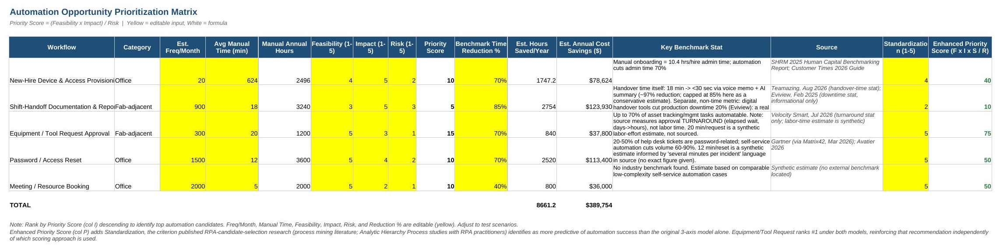

## 3-Year ROI Model (preview)

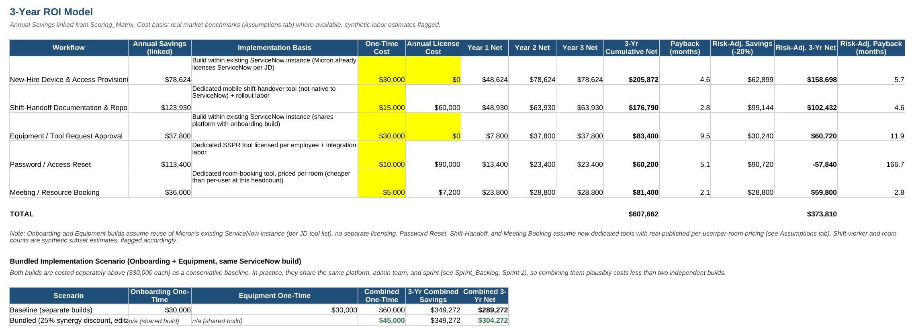

Full interactive workbook with editable assumptions: [`data/Automation_Priority_Matrix.xlsx`](data/Automation_Priority_Matrix.xlsx)

## Delivery Plan

The analysis above answers "should we automate this." These artifacts answer "how would a team actually build and roll it out," for the top-recommended workflow (Equipment/Tool Request Approval):

**User stories + acceptance criteria** (10 stories, 44 story points), written against the future-state process map:

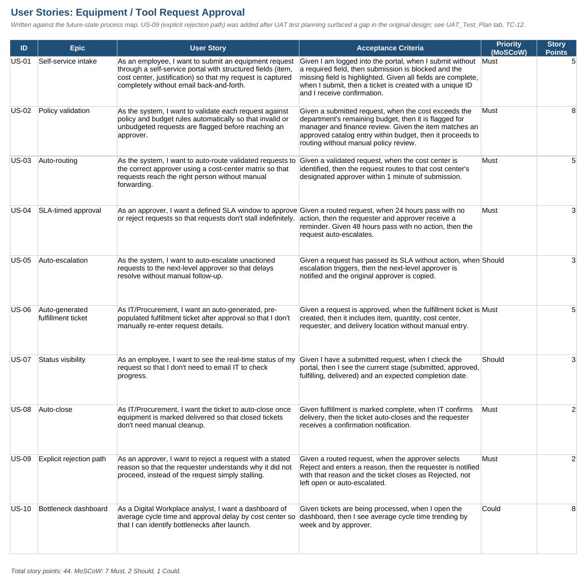

**UAT test plan** (13 test cases), including one gap the test-planning process itself surfaced: the original design had no explicit rejection path, closed by adding US-09 before build rather than after launch:

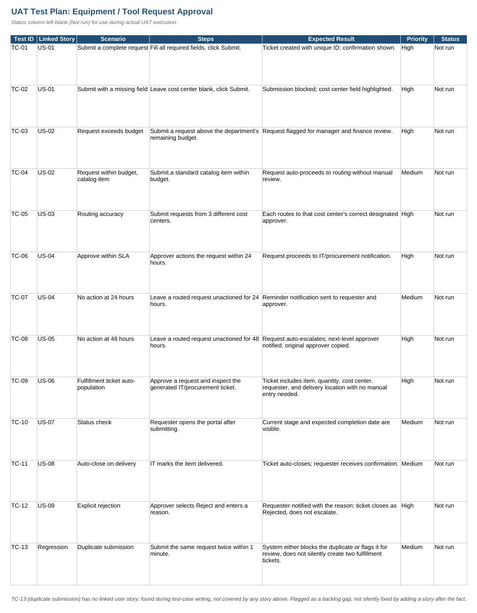

**Risk & dependency tracker** for the pilot (Equipment/Tool Request + Onboarding, both on ServiceNow), every item with a named owner:

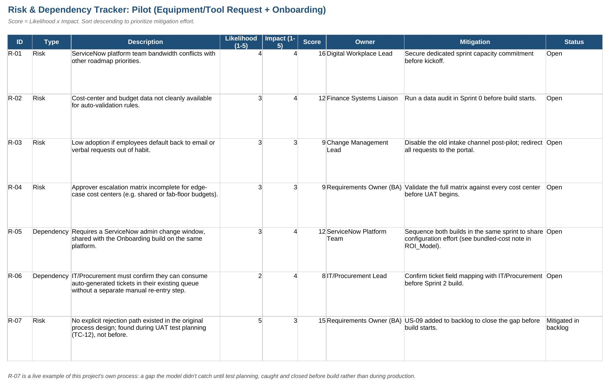

**Change management & adoption plan**: phased rollout, communication plan, adoption metrics defined before rollout starts, and multi-site rollout considerations reflecting Micron's actual footprint (Boise ID, Manassas VA, Syracuse NY, plus international sites), since a single-timezone, single-champion plan doesn't scale to a multi-fab company:

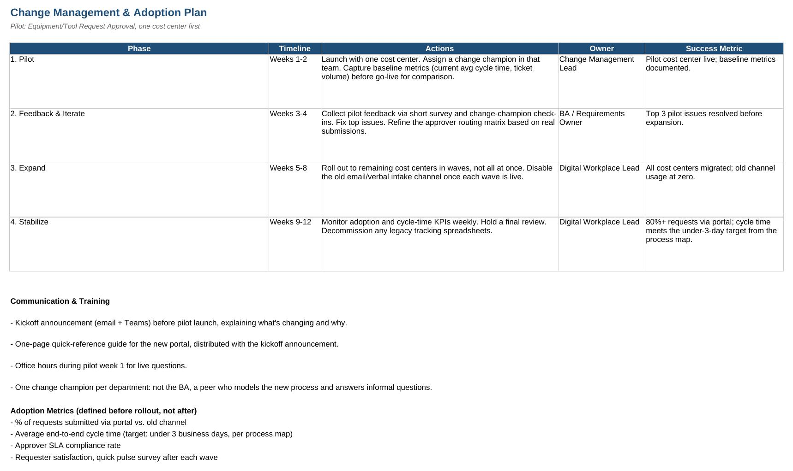

**Sprint backlog**: 3 build sprints plus discovery, Onboarding built in parallel since it shares the same platform. Also includes a concept-only stretch item (US-11); see "Beyond This MVP" below:

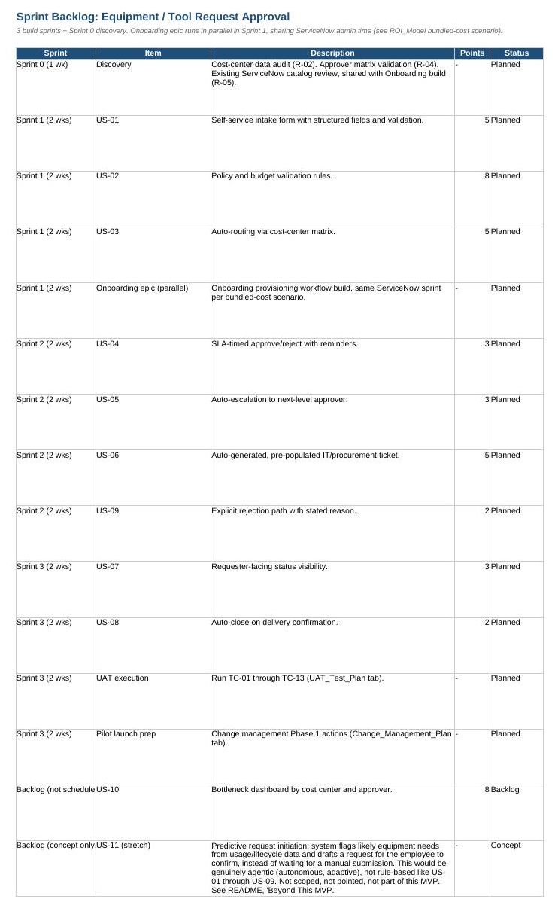

**Functional specification** for US-02 (policy/budget validation): the one story in the backlog with real business-rule complexity, spelled out as explicit IF/THEN rules, exception handling, data dependencies, and honestly flagged open questions rather than left at user-story level of detail.

Full workbook: [`data/Project_Delivery_Plan.xlsx`](data/Project_Delivery_Plan.xlsx)

**A finding worth naming:** Onboarding and Equipment/Tool Request are costed as two separate $30,000 ServiceNow builds in the ROI model above, a conservative baseline. Since they share the same platform, admin team, and sprint (see the backlog), bundling them plausibly costs less. The ROI_Model tab now includes an editable bundled scenario: a 25% synergy discount drops the combined one-time cost from $60,000 to $45,000, adding roughly $15,000 to the combined 3-year net. The 25% is a planning assumption, not a sourced figure, and is called out as such in the workbook.

## AI & Tool Fit

The JD names specific tools (ServiceNow, Jira, Azure DevOps) and an interest in AI/LLMs. Three artifacts translate the analysis above into the actual formats those tools and workflows use:

- **Jira-ready import**: all 10 user stories exported as a CSV matching Jira's import format (Issue Type, Summary, Story Points, Priority, Epic Link, Sprint). [`exports/jira_import_user_stories.csv`](exports/jira_import_user_stories.csv)
- **ServiceNow Business Rule**: the 5 business rules (BR-1 to BR-5) from the US-02 functional spec, written as an actual ServiceNow Business Rule script (GlideRecord-based), not generic pseudocode. Illustrative, not tested against a live instance. [`exports/servicenow_business_rule_US-02.js`](exports/servicenow_business_rule_US-02.js)
- **AI-assisted UAT, with the miss shown**: the exact prompt used to draft first-pass test cases from a user story, the raw AI output, and what a human review caught: the draft missed the one behavior (does not auto-escalate) the story actually existed to test. Full detail: `data/Project_Delivery_Plan.xlsx`, tab `AI_Assisted_UAT_Notes`.

This "AI drafts, a person checks the draft against the actual risk it's supposed to catch" pattern isn't invented for this project. It mirrors what Micron itself says about internal AI use: *"Teams across engineering, marketing and operations are using AI assistants, generative design tools and AI agents to streamline workflows... We have established clear guidelines for responsible AI use"* (Micron blog, "From data to intelligence: Micron's role in the AI revolution," Aug 2025).

**A calibration note, not a claim:** Micron's own glossary defines agentic AI as systems with autonomy, adaptability, memory, and planning, and Micron uses it for exactly that (autonomous preventive-maintenance decisions from acoustic and thermal sensor data, per its Smart Manufacturing blog). The ServiceNow Business Rule above is not that. BR-1 through BR-5 are deterministic if/then logic; Micron's own AI glossary has a precise term for this: *"rule-based inference... valuable in expert systems and compliance-driven environments where transparency and determinism are essential"* (Micron glossary, "What is AI inference?"). Calling a business rule "agentic AI" would be overclaiming by Micron's own definition. It's labeled accurately here instead.

## Process Maps

**Equipment/Tool Request Approval** (highest priority score), current-state vs. future-state by role (Employee, Manager/Approver, System, IT/Procurement), with SLA timing at each handoff:

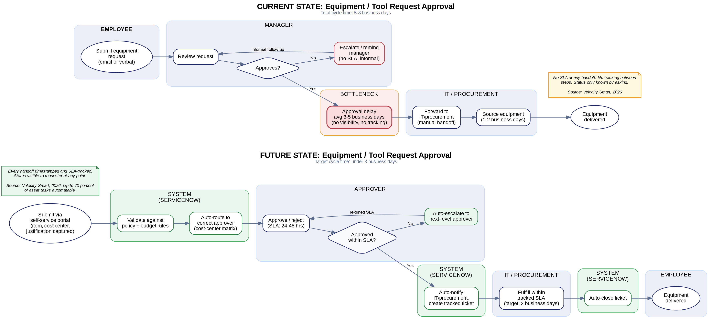

**Password/Access Reset** (the workflow that failed the risk-adjustment stress test), current-state vs. future-state:

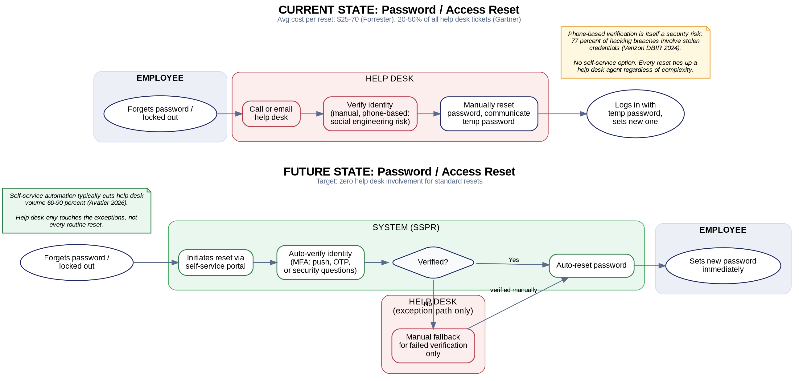

## Beyond This MVP

The Equipment/Tool Request future-state above is deliberately rule-based: an employee submits, the system validates and routes, an approver decides. That's the right scope for an MVP, not a limitation to hide.

A further step exists, and it's worth naming honestly rather than pretending the MVP already does it. Micron's own Smart Manufacturing blog describes using agentic AI (autonomous, adaptive, sensor-driven decision-making) for preventive maintenance: the system doesn't wait for a technician to notice a problem, it predicts one from acoustic and thermal sensor data and acts. The same shift could apply here: instead of an employee remembering to submit an equipment request, a genuinely agentic future-state could predict likely equipment needs from usage or lifecycle data and draft the request for the employee to confirm.

This is not built, not scoped, and not story-pointed. It's logged as a concept-only backlog item (US-11) specifically so it's visible without being confused for something already delivered. The distance between "rule-based" (what's here) and "agentic" (what Micron's own glossary reserves that word for) is the honest way to describe where this MVP's ceiling is.

## Visualizations

Five charts beyond the tables and bar chart already in the deck, covering ROI structure, ranking robustness, and risk exposure. All pull from the same verified numbers as the rest of the project.

**ROI Build-Up (waterfall):** total savings minus one-time costs minus license costs, step by step to Year 1 Net.

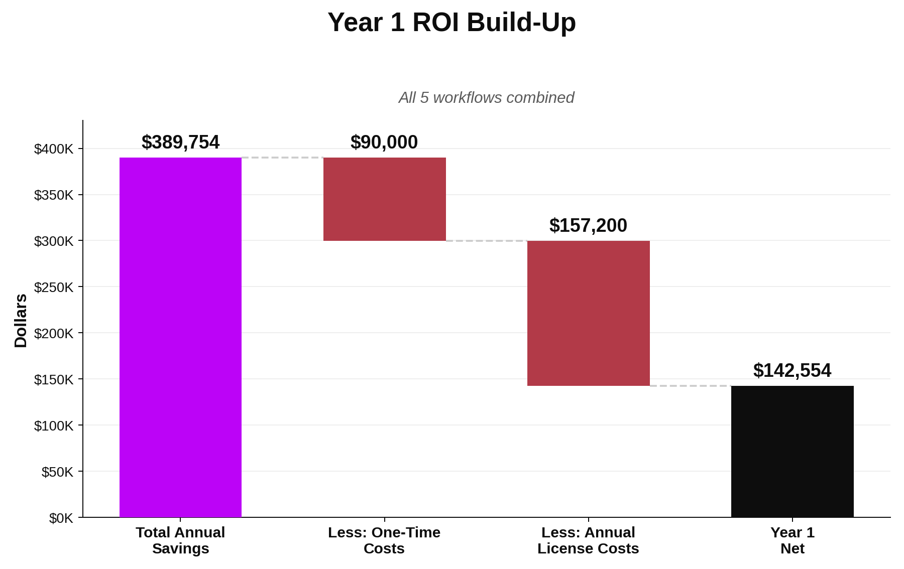

**Payback Ranking:** all 5 workflows by how fast they pay for themselves.

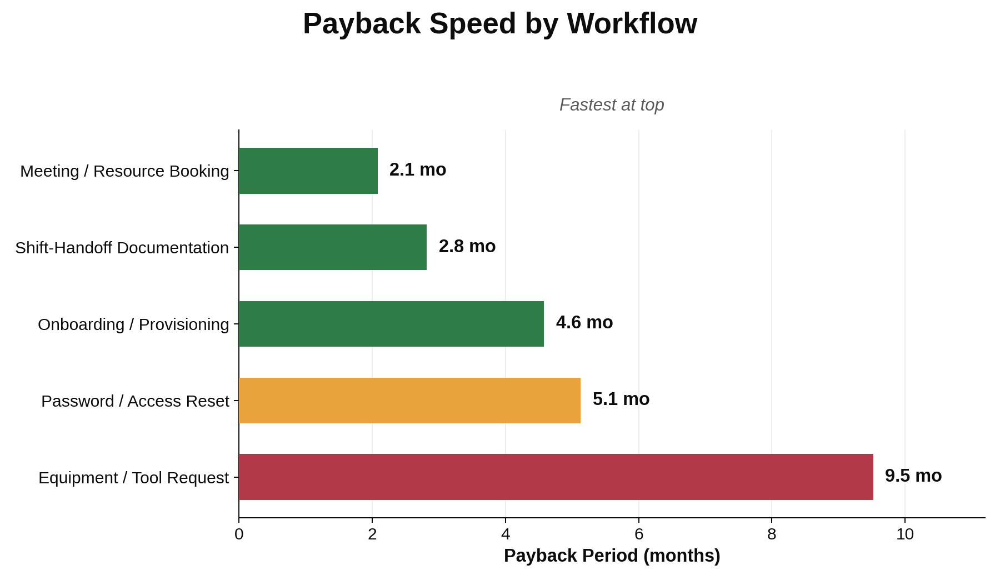

**Dual-Model Ranking:** the same slope pattern behind the "Equipment ranks #1 under both models" claim in the Sensitivity Analysis section, made visible instead of stated in prose.

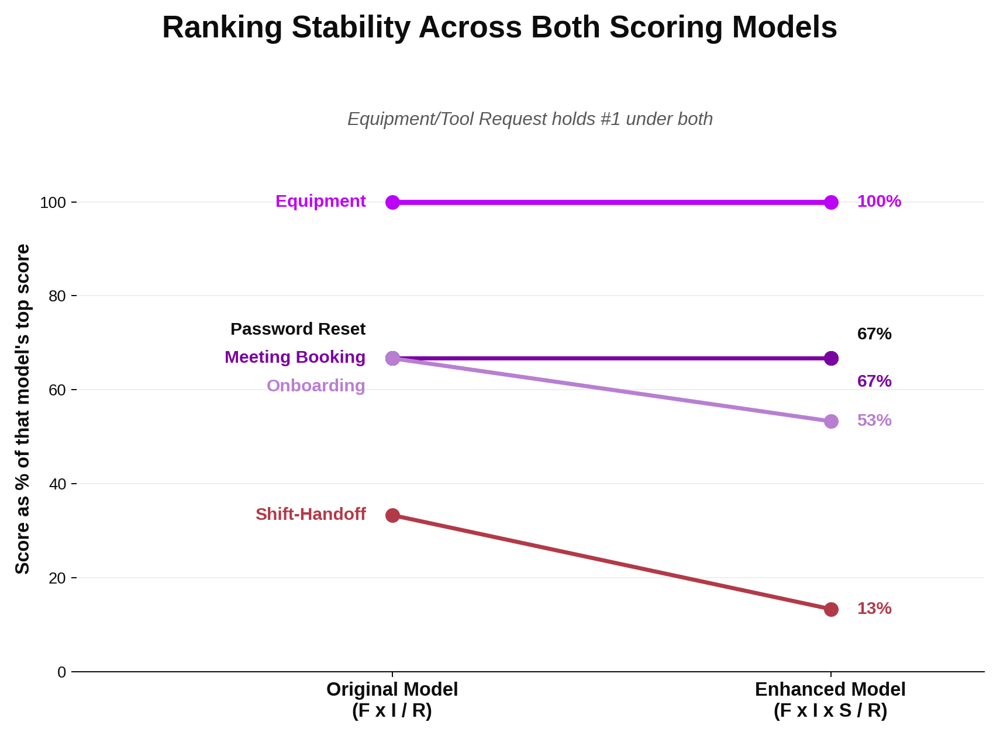

**Risk Heatmap:** all 7 items from the delivery plan's Risk & Dependency Tracker, plotted by Likelihood x Impact.

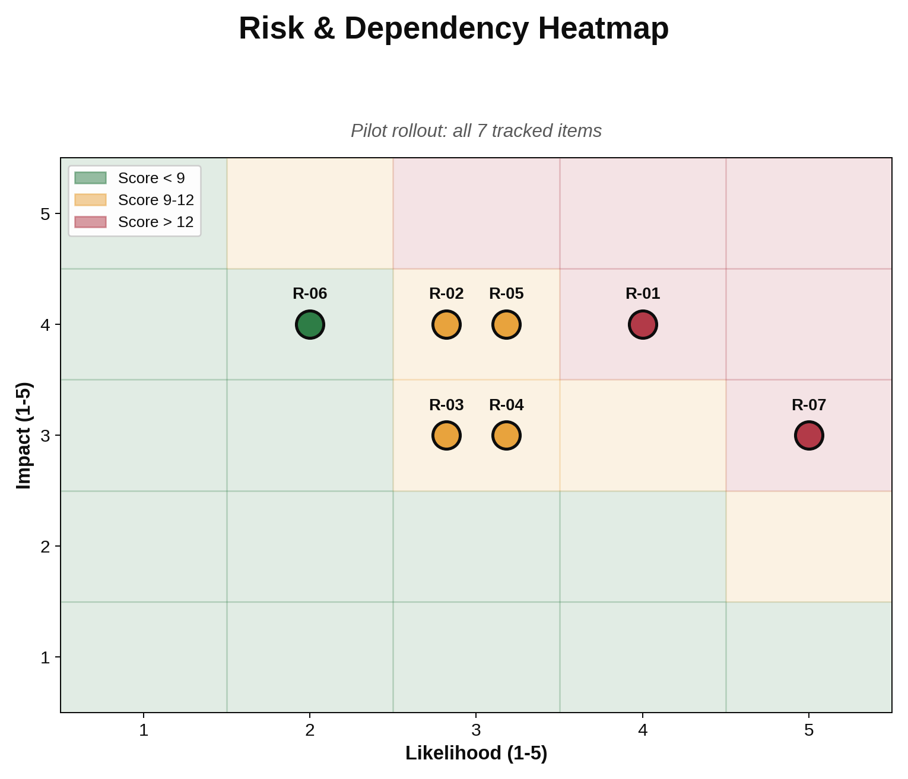

**Micron Scale:** the reference-model estimate next to the directional extrapolation to Micron's actual headcount.

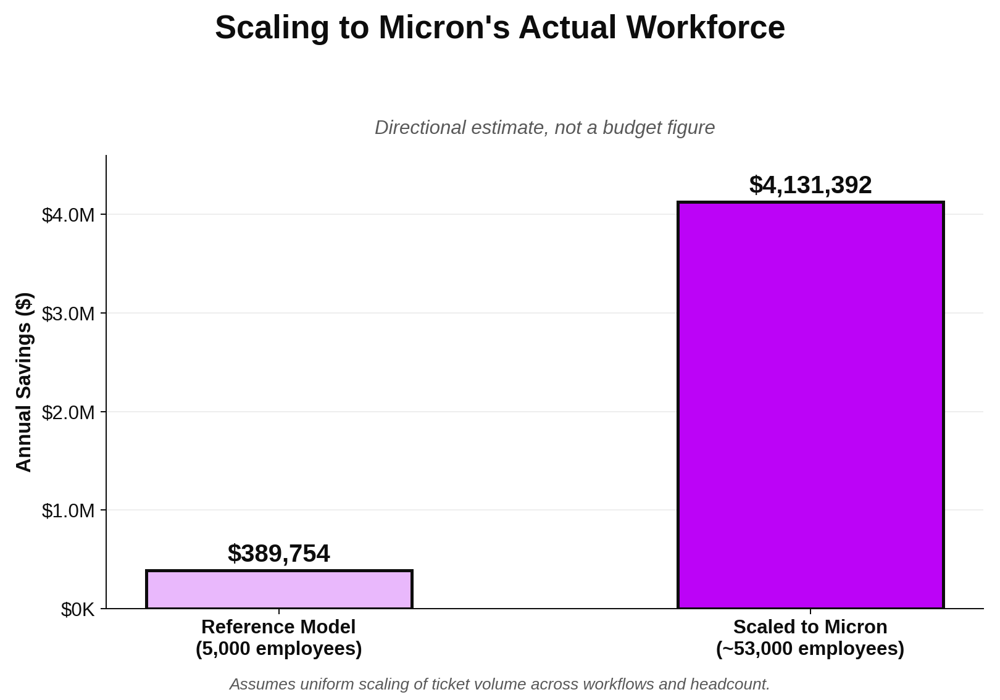

**Interactive version:** [`visualizations/interactive_dashboard.html`](visualizations/interactive_dashboard.html) has all 5 as tabbed, hoverable charts (Chart.js, bundled inline, no internet connection needed). GitHub can't execute JavaScript inline, so download the file and open it in any browser to use it; the static images above are the same charts for quick viewing directly on this page.

## Deck

[View the 7-slide summary deck (PDF)](deck/Micron_Automation_Priority_Deck.pdf). Renders directly in-browser, no download needed.
Editable source: [`deck/Micron_Automation_Priority_Deck.pptx`](deck/Micron_Automation_Priority_Deck.pptx)

## Repo Structure

```
data/            Automation_Priority_Matrix.xlsx: Assumptions, Scoring Matrix, ROI Model, Sensitivity Analysis, Benchmark Sources, Values Alignment
                  Project_Delivery_Plan.xlsx: User Stories, UAT Test Plan, Risk & Dependency Tracker, Change Management Plan, Sprint Backlog, Functional Spec (US-02), AI-Assisted UAT Notes
exports/         Jira-ready CSV import and a ServiceNow Business Rule script derived from the functional spec
process_maps/    Current vs future-state diagrams for both Equipment/Tool Request and Password Reset
deck/            7-slide executive summary deck (.pptx and .pdf)
visualizations/  5 charts (ROI waterfall, payback ranking, dual-model ranking, risk heatmap, Micron scale) as static PNGs plus one interactive tabbed HTML dashboard
previews/        Static images of key sheets and charts, embedded above for quick viewing
```

## Methodology Notes

- Cost basis is real, not synthetic, where published data existed: ServiceNow implementation partner fees (Quackback), SSPR licensing (G2/PortalGuard), shift-handoff tools (ZipDo), meeting-room booking (Archie). Where no public figure existed, the workbook flags the estimate explicitly rather than presenting it as sourced.
- Onboarding and Equipment/Tool Request builds assume reuse of Micron's existing ServiceNow instance (per the job posting's own tool list) rather than new software procurement, avoiding redundant licensing.
- Every number in the workbook is traceable to a cited source in the Benchmark_Sources tab.
- Company-level figures (headcount, revenue, SG&A) are sourced from Micron's FY2025 Form 10-K, filed with the SEC.

## Tools Used

Excel (openpyxl), PowerPoint (pptxgenjs), Graphviz, web research (Gartner, Forrester, SHRM, Verizon DBIR, SEC filings, industry vendor benchmarks).

## How This Reflects Micron's Values

Micron's stated core values are People, Innovation, Tenacity, Collaboration, and Customer Focus, with Integrity as a foundational principle underneath all five (per Micron's Code of Business Conduct and Ethics). Rather than claim alignment in the abstract, each value is mapped to one specific decision already made in this project, not retrofitted afterward:

- **People**: Password/Access Reset was not recommended for funding once the risk-adjusted model showed a thin margin, and it's flagged as likely already partly covered by Micron's existing Microsoft 365/Entra ID tenant.
- **Innovation**: the original 3-axis scoring model was extended with a Standardization axis after research into RPA candidate-selection literature showed it's more predictive of automation success than the original model alone.
- **Tenacity**: two real errors were caught and fixed mid-build (a turnaround-vs-labor-time conflation, a downtime-vs-handover-time metric mismatch), documented in place rather than silently corrected.
- **Collaboration**: the Risk & Dependency Tracker names a specific owner for every item (ServiceNow Platform Team, IT/Procurement Lead, Finance Systems Liaison), not a generic "IT team."
- **Customer Focus**: every future-state process map keeps requester-facing status visibility as a first-class requirement, not an afterthought.
- **Integrity**: the Sensitivity Analysis and risk-adjusted stress test exist specifically to find and report the recommendation that doesn't hold up, not just the ones that do.

Full detail and specific artifact references: [`data/Automation_Priority_Matrix.xlsx`](data/Automation_Priority_Matrix.xlsx), `Values_Alignment` tab.

## What This Enables

The model gives a Digital Workplace team a repeatable, evidence-based way to rank automation candidates instead of prioritizing by instinct. Applied to the five workflows here, it identifies which requests can be automated within Micron's existing ServiceNow investment (no new procurement), which need new tooling with a fast payback, and which look attractive on paper but do not survive a basic risk check, before budget is committed to them. The process map translates the highest-scoring candidate into a concrete, role-by-role redesign with SLA targets, the kind of artifact a Digital Workplace team could hand to engineering as a build spec.
